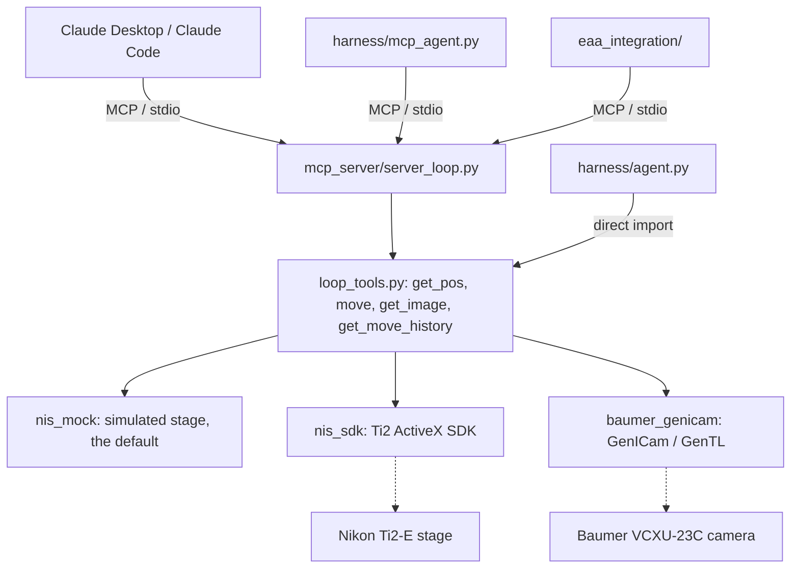

<div align="center">

# microscope-agent

**microscope-agent is a minimal MCP server for driving a real Nikon Ti2-E
microscope from an AI agent.**

Exactly four tools — enough for Claude Desktop, Claude Code, or any other MCP
client to move the stage and look through the camera.

[](LICENSE)
[](pyproject.toml)
[](https://modelcontextprotocol.io)
[](CHANGELOG.md)

</div>

---

No NIS-Elements anywhere: the camera is reached directly via GenICam/GenTL, the
stage via the Ti2 ActiveX SDK — both independent of whether NIS-Elements is even
running. A core install ships a safe simulated stage, so the server runs on a
laptop or in CI with zero hardware attached.

## Contents

- [Architecture](#architecture)
- [The four tools](#the-four-tools)
- [Install](#install)
- [Run](#run)
- [Three ways to drive it](#three-ways-to-drive-it)
- [Hardware](#hardware)
- [Versioning & license](#versioning--license)

## Architecture



## The four tools

Kept minimal on purpose — calibration, historical-frame lookup, and the rest are
things the model should reason out from `get_image`'s embedded picture, not a new
tool per capability.

| Tool | What it does |
|---|---|
| **`get_pos(backend)`** | Current stage `(x, y, z)` in microns. A cheap on-demand sync primitive — not something to call before every move, since `get_image` / `move` already return position with their result. |
| **`move(x, y, backend, confirm)`** | Move the XY stage to an absolute position; returns the *actual* resulting position. XY-only on purpose — no absolute Z move is reachable from chat (crash risk into the sample). |
| **`get_image(confirm, exposure_time_us, gain, crop, max_dimension)`** | Capture a real frame, paired with the exact stage position it was taken at. Returns metadata **and an embedded preview**, so the model actually sees the picture. `crop` restricts the preview to a region of interest; the full-res file on disk is always uncropped. |
| **`get_move_history(limit)`** | Every point `move()` has sent the stage to this session — so "where have we already been" isn't re-derived from chat history. |

`get_pos` / `move` / `get_image` all return **`stage_revision`**, a monotonic
counter bumped whenever a call observes the stage somewhere new — so a model
holding an older result can tell whether the stage moved since (someone touched
the joystick) without diffing raw coordinates. `get_image` also returns
**`frame_id`**, a per-process capture counter.

`backend` is `"mock"` (default, safe, simulated) or `"sdk"` (real hardware).
Anything touching real hardware requires `confirm=True`. See the header comment in
[`mcp_server/loop_tools.py`](mcp_server/loop_tools.py) for the full design
rationale (why no `get_time()`, why position is a return value and not ambient
context, etc.).

## Install

An installable package (`confocal-mcp`) with a console entry point. Dependencies
are split into groups so a machine only pulls what it needs:

| Group | Pulls in | For |
|---|---|---|
| *(core)* | `mcp`, `Pillow`, `PyYAML` | the MCP server against the **mock** stage |
| `camera` | `harvesters`, `genicam`, `opencv-python` | real Baumer camera capture |
| `sdk` | `pywin32` | real Ti2 stage control (Windows) |
| `harness` | `anthropic`, `python-dotenv` | the standalone Claude loops in `harness/` |
| `all` | everything above | a full workstation |

Real hardware backends are imported lazily, so a core-only install runs fine
anywhere — it just can't touch hardware.

### From a source checkout

```
python -m venv .venv
.venv\Scripts\pip install -e ".[camera,sdk]"     # real hardware
.venv\Scripts\pip install -r requirements.txt    # == -e ".[all]"
```

### As a standalone tool (isolated, no repo checkout)

```
uv tool install "git+https://github.com/BioNanomics/microscope-agent[camera,sdk]"
# or: pipx install "git+https://github.com/BioNanomics/microscope-agent[camera,sdk]"
```

### Real stage backend (one extra step)

[`acquisition/backends/nis_sdk.py`](acquisition/backends/nis_sdk.py) imports
`NkTi2Ax`, the Nikon Ti2 SDK's generated Python bindings — machine-generated (via
`pywin32`'s `gencache`/`makepy` against the installed SDK), not pip-installable,
and not in this repo. If it isn't already in `site-packages/`, let it regenerate
against an installed Ti2 SDK, or copy it from another working environment on the
same machine. Not needed for `backend="mock"`.

## Run

```
confocal-mcp                       # installed console script
python -m mcp_server.server_loop   # equivalent, from a source checkout
```

Point an MCP client at it — Claude Desktop's `claude_desktop_config.json`, or a
project-level `.mcp.json` for Claude Code:

```json
{ "mcpServers": { "confocal": { "command": "confocal-mcp" } } }
```

Runtime data (captures, move/frame history logs) is written under the current
working directory when the server runs from an installed package — launch it from
a stable location, or set `CONFOCAL_MCP_DATA_DIR`.

## Three ways to drive it

All three exercise the same four tool functions — pick whichever fits.

| | How it reaches the tools | Use it when |
|---|---|---|
| **MCP client** (Claude Desktop/Code) | `confocal-mcp` over MCP/stdio | day-to-day use |
| **`harness/agent.py`** | imports `loop_tools.py` in-process, calls Claude directly | simplest standalone script, one machine |
| **`harness/mcp_agent.py`** | spawns `server_loop.py` as a subprocess, real MCP over stdio | testing the server itself, or a split harness/microscope setup |

The two harness loops need `ANTHROPIC_API_KEY` (a repo-root `.env`, an env var, or
`ant auth login`). Real hardware always pauses for a live `y/N` approval at the
terminal before executing, whatever the model asks for. Old captured images are
pruned from context after a couple of turns
([`harness/context.py`](harness/context.py)) so long sessions don't keep
resending every frame.

```
python -m harness.agent        # in-process loop
python -m harness.mcp_agent     # real MCP client/server boundary
```

See **[`docs/mcp_harness.md`](docs/mcp_harness.md)** for the deep dive: how the
current MCP protocol differs from most tutorials, why `confirm` is stripped from
every tool schema before Claude sees it, the MCP↔Anthropic content-block
conversion, and a real stdout/JSON-RPC bug this work found and fixed in
`nis_mock.py`.

There's also **[`eaa_integration/`](eaa_integration/)** — the unmodified server
wrapped as a tool inside [EAA (Experiment Automation
Agents)](https://github.com/AdvancedPhotonSource/EAA), fully isolated in its own
folder and venv.

## Hardware

- **Stage / focus** — Nikon Ti2-E via the Ti2 ActiveX SDK
  ([`nis_sdk.py`](acquisition/backends/nis_sdk.py)). Real hardware, no
  NIS-Elements process required.
- **Camera** — Baumer VCXU-23C via GenICam/GenTL
  ([`baumer_genicam.py`](acquisition/backends/baumer_genicam.py)). A separate
  industrial camera, *not* the confocal N-SPARC detector. Only one application can
  hold it open at a time — close Baumer Camera Explorer (or any other GenICam
  consumer) before running this.

## Versioning & license

Versions follow [SemVer](https://semver.org/); see
[`CHANGELOG.md`](CHANGELOG.md). The current version is importable as
`mcp_server.__version__` (from installed package metadata).

MIT — see [`LICENSE`](LICENSE).
